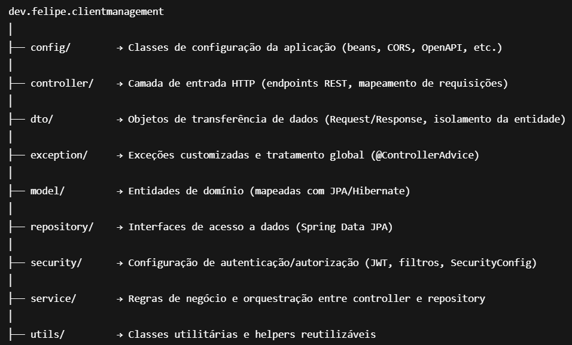

# Client Management API

## API REST para gerenciamento de clientes com autenticação e compartilhamento.
O objetivo desse projeto é presentar minhas habilidades como desenvolvedor backend __Java + Springboot__ em um __CRUD__ que respeite os padrões __SOLID__ e __REST__. Esse README explicará tudo o que precisa saber sobre o projeto, além de rodá-lo localmente.

---

## Acesse
Esse projeto está no ar nesse momento, para testá-lo agora acesse: www.meucodigo.com

---

## Frontend
Existe também um frontend que consome essa API, peço que não se atente ao código (React + Typescript) tendo em vista que não é o foco do projeto, mas se quiser [clique aqui]().

---

## Arquitetura do projeto
Arquiteturas em camadas:

- Security → Filtros de autenticação (JWT)
- Controller → Camada de entrada (HTTP)
- Service → Regras de negócio
- Repository → Persistência (JPA)

Padrões aplicados:
- DTO Pattern
- Dependency Injection
- RESTful Design

---

## Layout dos diretórios



---

## Pré-requisitos

- Java 21 instalado
- Maven 3.9+
- PostgreSQL configurado

---

## Configuração

Variáveis necessárias no application.properties

``` 
- spring.datasource.url={URL DO SEU POSTGRES}
- spring.datasource.username={NOME DO SEU POSTGRES}
- spring.datasource.password={SENHA DO SEU POSTGRES} 
- jwt.secret={SUA CHAVE SECRETA}
```
---

## Como executar

``` bash
mvn clean install
mvn spring-boot:run
```

---

## Licença

MIT License